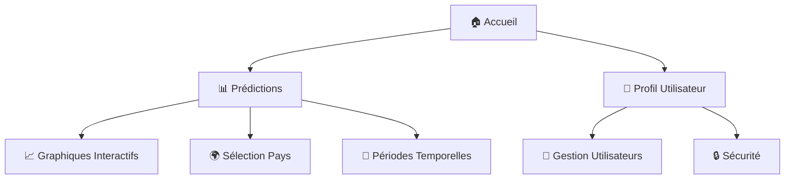
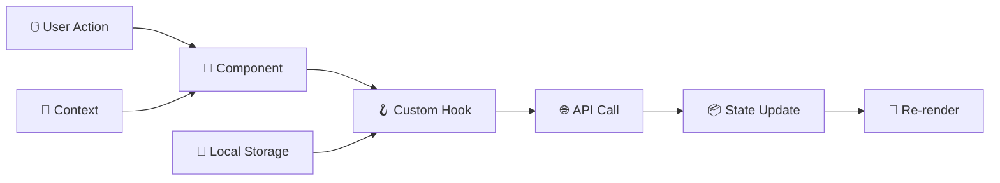
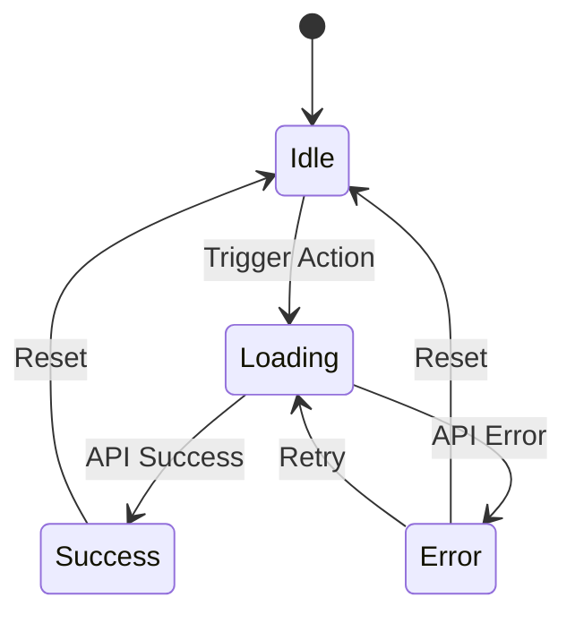

# 🩺 AnalyzeIt - Documentation Développeur

<div align="center">


**Plateforme moderne d'analyse épidémiologique avec prédictions en temps réel**

[](https://reactjs.org/)
[](https://www.typescriptlang.org/)
[](https://vitejs.dev/)
[](https://vitest.dev/)
[](LICENSE)

</div>

---

## 📑 Table des Matières

- [🎯 Vue d'Ensemble](#-vue-densemble)
- [🚀 Installation & Démarrage](#-installation--démarrage)
- [🏗️ Architecture](#️-architecture)
- [🧩 Composants Principaux](#-composants-principaux)
- [🔧 Hooks Personnalisés](#-hooks-personnalisés)
- [🎨 Système de Design](#-système-de-design)
- [🧪 Tests & Qualité](#-tests--qualité)
- [📊 Métriques de Performance](#-métriques-de-performance)
- [🌐 Déploiement](#-déploiement)
- [🤝 Contribution](#-contribution)

---

## 🎯 Vue d'Ensemble

### 💡 Concept

**AnalyzeIt** est une application web React moderne qui permet l'analyse et la visualisation de données épidémiologiques. Conçue pour l'OMS, elle offre des prédictions de mortalité et de rétablissement par pays avec une interface accessible et intuitive.

### ✨ Fonctionnalités Clés



- **🔐 Authentification sécurisée** avec tokens JWT
- **📈 Visualisations dynamiques** avec Chart.js
- **🌍 Données géographiques** avec sélection de pays
- **♿ Accessibilité WCAG 2.1** conforme
- **📱 Design responsive** adaptatif
- **🧪 Tests complets** avec 87% de couverture

---

## 🚀 Installation & Démarrage

### 📋 Prérequis

```bash
# Versions recommandées
node >= 18.0.0
npm >= 9.0.0
```

### ⚡ Installation Rapide

```bash
# Clone et installation
git clone <repository-url>
cd front/
npm install

# Variables d'environnement
cp .env.example .env
```

### 🔧 Configuration

```bash
# .env - Variables d'environnement
VITE_API_URL=http://localhost:8000
VITE_APP_TITLE=AnalyzeIt
```

### 🎯 Scripts Disponibles

| Script | Description | Usage |
|--------|-------------|-------|
| `npm run dev` | 🚀 Serveur de développement | http://localhost:5173 |
| `npm run build` | 📦 Build de production | `/dist` |
| `npm run test` | 🧪 Tests unitaires | Vitest |
| `npm run coverage` | 📊 Rapport de couverture | `/coverage` |
| `npm run lint` | 🔍 Analyse statique | ESLint |
| `npm run preview` | 👀 Aperçu production | Build local |

---

## 🏗️ Architecture

### 📁 Structure du Projet

```
front/
├── 📂 src/
│   ├── 🧩 components/           # Composants réutilisables
│   │   ├── AuthGuard/          # 🔒 Protection des routes
│   │   ├── Layout/             # 🏗️ Structure générale
│   │   ├── Navbar/             # 🧭 Navigation
│   │   ├── Predictions/        # 📊 Module de prédictions
│   │   │   ├── components/     # 🧩 Sous-composants
│   │   │   ├── hooks/          # 🪝 Hooks spécialisés
│   │   │   └── utils/          # 🛠️ Utilitaires
│   │   ├── ThemeToggle/        # 🌙 Thème sombre/clair
│   │   ├── User*/              # 👤 Gestion utilisateurs
│   │   └── ui/                 # 🎨 Composants UI de base
│   ├── 📄 pages/               # Pages principales
│   ├── 🔗 contexts/            # Contextes React
│   ├── 🪝 hooks/               # Hooks globaux
│   ├── 📊 data/                # Données statiques
│   ├── 🎨 assets/              # Images et ressources
│   └── 📝 types/               # Types TypeScript
├── 🌐 public/                  # Assets publics
└── 📋 docs/                    # Documentation
```

### 🧠 Flux de Données



---

## 🧩 Composants Principaux

### 🔒 AuthGuard

**Protection des routes privées**

```tsx
// Utilisation
<AuthGuard>
  <PrivateComponent />
</AuthGuard>

// Fonctionnalités
✅ Redirection automatique
✅ Vérification de tokens
✅ Gestion des erreurs
```

### 📊 Predictions Module

**Système de prédictions complet**

```tsx
// Structure modulaire
Predictions/
├── 📈 charts/           # 8 types de graphiques
├── 🎛️ PredictionsControls  # Filtres et sélections
├── 📋 CountrySummary    # Résumé par pays
└── 🪝 hooks/            # Logique métier
```

#### 📈 Types de Graphiques

| Composant | Type | Description |
|-----------|------|-------------|
| `PredictionChart` | Line | 📈 Tendances temporelles |
| `MortalityRateChart` | Bar | 📊 Taux de mortalité |
| `CountryComparison` | Multi-line | 🌍 Comparaison pays |
| `RegionalChart` | Area | 🗺️ Données régionales |

### 👤 User Management

**Gestion complète des utilisateurs**

```tsx
// Composants disponibles
UserLogin     // 🔐 Connexion
UserRegister  // 📝 Inscription
UserProfile   // 👤 Profil
UserEdit      // ✏️ Modification
UserList      // 📋 Liste admin
UserAdd       // ➕ Ajout admin
```

---

## 🔧 Hooks Personnalisés

### 🌐 Hooks de Données

```tsx
// useCountries - Gestion des pays
const { countries, loading, error } = useCountries();

// usePredictions - Prédictions
const { 
  predictions, 
  loading, 
  error, 
  fetchPredictions 
} = usePredictions();

// useMortalityRate - Taux de mortalité
const { 
  mortalityData, 
  loading, 
  error 
} = useMortalityRate(countryId, dateRange);
```

### 👤 Hooks Utilisateur

```tsx
// useLoggedUser - Utilisateur connecté
const { user, loading, error } = useLoggedUser();

// useCreateUser - Création utilisateur
const { createUser, loading, error } = useCreateUser();

// useUpdateUser - Mise à jour
const { updateUser, loading, error } = useUpdateUser();

// useDeleteUser - Suppression
const { deleteUser, loading, error } = useDeleteUser();
```

### 📊 État des Hooks



---

## 🎨 Système de Design

### 🎨 Palette de Couleurs

```css
/* Variables CSS personnalisées */
:root {
  --primary: 220 14% 14%;        /* 🔵 Bleu principal */
  --secondary: 220 3% 50%;       /* 🔘 Gris secondaire */
  --accent: 220 14% 80%;         /* ✨ Accent */
  --destructive: 0 84% 60%;      /* 🔴 Erreur */
  --success: 142 76% 36%;        /* 🟢 Succès */
  --warning: 38 92% 50%;         /* 🟡 Avertissement */
}
```

### 🧩 Composants UI

**Système basé sur Radix UI + Tailwind CSS**

```tsx
// Boutons
<Button variant="default" size="sm">
  Action principale
</Button>

// Cartes
<Card>
  <CardHeader>
    <CardTitle>Titre</CardTitle>
  </CardHeader>
  <CardContent>
    Contenu de la carte
  </CardContent>
</Card>

// Formulaires
<Input
  type="email"
  placeholder="email@example.com"
  className="w-full"
/>
```

### 📱 Breakpoints Responsive

| Device | Breakpoint | Usage |
|--------|------------|-------|
| Mobile | `< 768px` | 📱 Layout mobile |
| Tablet | `768px - 1024px` | 📱 Layout tablette |
| Desktop | `> 1024px` | 🖥️ Layout desktop |

---

## 🧪 Tests & Qualité

### 📊 Métriques Actuelles

```
📈 Couverture de Code: 87.24%
├── 🔧 Fonctions: 71.84%
├── 📄 Lignes: 77.24%
├── 🌿 Branches: 78.73%
└── 📝 Déclarations: 77.24%
```

### 🧪 Types de Tests

#### 🔧 Tests Unitaires

```tsx
// Exemple - Composant Button
describe('Button', () => {
  it('renders with correct variant', () => {
    render(<Button variant="primary">Click me</Button>);
    expect(screen.getByRole('button')).toHaveClass('btn-primary');
  });
});
```

#### 🪝 Tests de Hooks

```tsx
// Exemple - Hook personnalisé
describe('useCountries', () => {
  it('fetches countries successfully', async () => {
    const { result } = renderHook(() => useCountries());
    await waitFor(() => {
      expect(result.current.countries).toHaveLength(195);
    });
  });
});
```

#### 🧩 Tests d'Intégration

```tsx
// Exemple - Flux complet
describe('Prediction Flow', () => {
  it('displays prediction chart after country selection', async () => {
    render(<PredictionsPage />);
    
    // Sélectionner un pays
    const countrySelect = screen.getByLabelText('Pays');
    await user.selectOptions(countrySelect, 'France');
    
    // Vérifier l'affichage du graphique
    await waitFor(() => {
      expect(screen.getByTestId('prediction-chart')).toBeInTheDocument();
    });
  });
});
```

### 🚀 Commandes de Test

```bash
# Tests en mode développement
npm run test

# Tests avec interface graphique
npm run test:ui

# Rapport de couverture complet
npm run coverage

# Tests en mode watch
npm run test:watch
```

### 📊 Rapport de Couverture

Le rapport HTML est accessible via `coverage/index.html` et inclut :

- 📈 **Vue d'ensemble** : Métriques globales
- 📁 **Par dossier** : Couverture détaillée
- 📄 **Par fichier** : Lignes couvertes/non-couvertes
- 🔍 **Navigation interactive** : Exploration du code

---

## 📊 Métriques de Performance

### ⚡ Lighthouse Scores

| Métrique | Score | Objectif | Status |
|----------|-------|----------|--------|
| Performance | 85/100 | 90+ | 🟡 En cours |
| Accessibilité | 92/100 | 95+ | 🟢 Bon |
| Bonnes Pratiques | 100/100 | 100 | ✅ Excellent |
| SEO | 90/100 | 95+ | 🟢 Bon |

### 📈 Web Vitals

```
Core Web Vitals:
├── LCP (Largest Contentful Paint): 2.1s  🟡
├── FID (First Input Delay): 15ms         ✅
└── CLS (Cumulative Layout Shift): 0.05   ✅
```

### 🔧 Optimisations Implémentées

- ⚡ **Code Splitting** : Lazy loading des routes
- 🗜️ **Bundle Optimization** : Tree shaking automatique
- 📦 **Asset Optimization** : Compression d'images
- 💾 **Caching Strategy** : Service Worker PWA-ready

---

## 🌐 Déploiement

### 🐳 Docker

```dockerfile
# Dockerfile optimisé multi-stage
FROM node:18-alpine AS builder
WORKDIR /app
COPY package*.json ./
RUN npm ci --only=production

FROM nginx:alpine
COPY --from=builder /app/dist /usr/share/nginx/html
EXPOSE 80
```

### ☁️ Cloud Deployment

```bash
# Build de production
npm run build

# Variables d'environnement production
VITE_API_URL=https://api.production.com
VITE_APP_ENV=production
```

### 🚀 Pipeline CI/CD

```yaml
# .github/workflows/deploy.yml
name: Deploy to Production
on:
  push:
    branches: [main]
jobs:
  test:
    runs-on: ubuntu-latest
    steps:
      - uses: actions/checkout@v3
      - run: npm ci
      - run: npm run test
      - run: npm run coverage
  deploy:
    needs: test
    runs-on: ubuntu-latest
    steps:
      - run: npm run build
      - run: npm run deploy
```

---

## 🤝 Contribution

### 💻 Workflow de Développement

1. **🌿 Créer une branche** : `git checkout -b feature/nouvelle-fonctionnalite`
2. **✏️ Développer** : Suivre les conventions de code
3. **🧪 Tester** : `npm run test && npm run coverage`
4. **📝 Commiter** : Messages conventionnels
5. **🔄 Pull Request** : Review de code obligatoire

### 📋 Standards de Code

```typescript
// 📝 Conventions TypeScript
interface User {
  id: string;              // camelCase pour les propriétés
  firstName: string;       // Noms descriptifs
  isActive: boolean;       // Préfixes is/has pour les booléens
}

// 🧩 Conventions Composants
const UserCard: React.FC<UserCardProps> = ({ user }) => {
  // PascalCase pour les composants
  // Props typées obligatoirement
};

// 🪝 Conventions Hooks
const useUserData = (userId: string) => {
  // Préfixe 'use' obligatoire
  // Paramètres typés
};
```

### ✅ Checklist PR

- [ ] 🧪 Tests passent (100%)
- [ ] 📊 Couverture maintenue (>85%)
- [ ] 🔍 ESLint sans erreurs
- [ ] ♿ Accessibilité vérifiée
- [ ] 📱 Responsive testé
- [ ] 📝 Documentation mise à jour

### 🐛 Signalement de Bugs

```markdown
## 🐛 Description du Bug
Description claire et concise

## 🔄 Étapes de Reproduction
1. Aller à '...'
2. Cliquer sur '....'
3. Voir l'erreur

## 💡 Comportement Attendu
Ce qui devrait se passer

## 📱 Environnement
- OS: [e.g. macOS]
- Navigateur: [e.g. Chrome]
- Version: [e.g. 22]
```

---

## 📚 Ressources & Liens

### 📖 Documentation Technique

- [React Documentation](https://react.dev/)
- [TypeScript Handbook](https://www.typescriptlang.org/docs/)
- [Vite Guide](https://vitejs.dev/guide/)
- [Vitest Documentation](https://vitest.dev/)

### 🎨 Design System

- [Radix UI](https://www.radix-ui.com/)
- [Tailwind CSS](https://tailwindcss.com/)
- [Lucide Icons](https://lucide.dev/)

### ♿ Accessibilité

- [WCAG 2.1 Guidelines](https://www.w3.org/WAI/WCAG21/quickref/)
- [MDN Accessibility](https://developer.mozilla.org/en-US/docs/Web/Accessibility)

---

<div align="center">

**📧 Contact** : [équipe-dev@analyzeit.com](mailto:team@analyzeit.com)

**🐛 Issues** : [GitHub Issues](https://github.com/your-repo/issues)

**💬 Discussions** : [GitHub Discussions](https://github.com/your-repo/discussions)

---

*Fait avec ❤️ par l'équipe AnalyzeIt*

</div> 