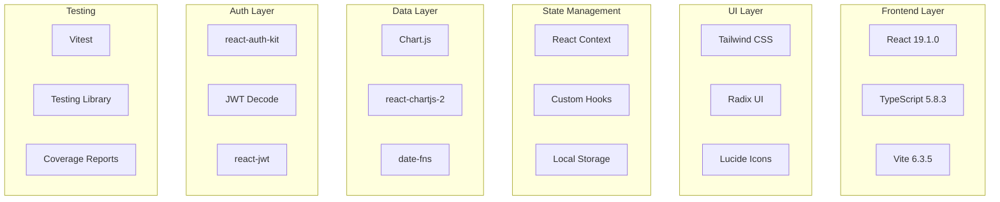
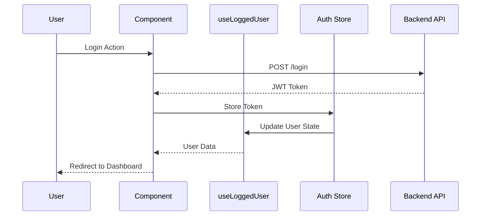

# 🔧 Guide Technique AnalyzeIt

## 📋 Architecture Technique Détaillée

### 🏗️ Stack Technologique



### 🔐 Système d'Authentification

#### Architecture JWT
```typescript
// Types d'authentification
interface AuthToken {
  token: string;
  refreshToken: string;
  expiry: number;
}

interface User {
  id_user: number;
  firstname: string;
  lastname: string;
  email: string;
  isAdmin: boolean;
}

// Configuration auth-kit
const store = createStore({
  authName: '_auth',
  authType: 'localstorage',
  cookieDomain: window.location.hostname,
  cookieSecure: window.location.protocol === 'https:',
});
```

#### Flux d'Authentification


### 📊 Gestion des Données

#### Hooks de Données Personnalisés
```typescript
// Pattern générique pour les hooks de données
interface DataHookState<T> {
  data: T | null;
  loading: boolean;
  error: string | null;
}

// Hook générique
function useApiData<T>(
  endpoint: string,
  dependencies: any[] = []
): DataHookState<T> & { refetch: () => void } {
  const [state, setState] = useState<DataHookState<T>>({
    data: null,
    loading: true,
    error: null,
  });
  
  const authHeader = useAuthHeader();
  
  const fetchData = useCallback(async () => {
    if (!authHeader) {
      setState(prev => ({ ...prev, error: 'Non authentifié' }));
      return;
    }
    
    try {
      setState(prev => ({ ...prev, loading: true, error: null }));
      
      const response = await fetch(`${API_BASE_URL}${endpoint}`, {
        headers: {
          'Authorization': authHeader,
          'Content-Type': 'application/json',
        },
      });
      
      if (!response.ok) {
        throw new Error(`HTTP ${response.status}`);
      }
      
      const data = await response.json();
      setState({ data, loading: false, error: null });
    } catch (error) {
      setState(prev => ({
        ...prev,
        loading: false,
        error: error instanceof Error ? error.message : 'Erreur inconnue',
      }));
    }
  }, [endpoint, authHeader, ...dependencies]);
  
  useEffect(() => {
    fetchData();
  }, [fetchData]);
  
  return { ...state, refetch: fetchData };
}
```

### 📈 Système de Graphiques

#### Configuration Chart.js
```typescript
// Configuration globale des graphiques
Chart.register(
  CategoryScale,
  LinearScale,
  PointElement,
  LineElement,
  BarElement,
  Title,
  Tooltip,
  Legend,
  Filler
);

// Thème par défaut
const defaultChartOptions: ChartOptions = {
  responsive: true,
  maintainAspectRatio: false,
  plugins: {
    legend: {
      position: 'top' as const,
      labels: {
        font: {
          family: 'Inter, sans-serif',
          size: 12,
        },
      },
    },
    tooltip: {
      backgroundColor: 'rgba(17, 24, 39, 0.95)',
      titleColor: '#F9FAFB',
      bodyColor: '#F9FAFB',
      borderColor: '#374151',
      borderWidth: 1,
    },
  },
  scales: {
    x: {
      grid: {
        color: 'rgba(156, 163, 175, 0.2)',
      },
      ticks: {
        font: {
          family: 'Inter, sans-serif',
          size: 11,
        },
      },
    },
    y: {
      grid: {
        color: 'rgba(156, 163, 175, 0.2)',
      },
      ticks: {
        font: {
          family: 'Inter, sans-serif',
          size: 11,
        },
      },
    },
  },
};
```

#### Composants de Graphiques
```typescript
// Composant de graphique réutilisable
interface ChartWrapperProps {
  title: string;
  subtitle?: string;
  children: ReactNode;
  actions?: ReactNode;
  loading?: boolean;
  error?: string;
}

const ChartWrapper: React.FC<ChartWrapperProps> = ({
  title,
  subtitle,
  children,
  actions,
  loading,
  error,
}) => {
  if (loading) {
    return (
      <Card>
        <CardContent className="flex items-center justify-center py-8">
          <div className="animate-spin rounded-full h-8 w-8 border-b-2 border-primary"></div>
        </CardContent>
      </Card>
    );
  }
  
  if (error) {
    return (
      <Card className="border-destructive">
        <CardContent className="flex items-center space-x-3 py-4">
          <AlertCircle className="h-5 w-5 text-destructive" />
          <div>
            <p className="font-medium text-destructive">Erreur</p>
            <p className="text-sm text-muted-foreground">{error}</p>
          </div>
        </CardContent>
      </Card>
    );
  }
  
  return (
    <Card>
      <CardHeader>
        <div className="flex items-center justify-between">
          <div>
            <CardTitle>{title}</CardTitle>
            {subtitle && (
              <p className="text-sm text-muted-foreground mt-1">{subtitle}</p>
            )}
          </div>
          {actions && <div className="flex space-x-2">{actions}</div>}
        </div>
      </CardHeader>
      <CardContent>
        <div className="h-80">
          {children}
        </div>
      </CardContent>
    </Card>
  );
};
```

### 🎨 Système de Thèmes

#### Configuration Tailwind
```javascript
// tailwind.config.js
module.exports = {
  content: ['./index.html', './src/**/*.{js,ts,jsx,tsx}'],
  darkMode: 'class',
  theme: {
    extend: {
      colors: {
        border: 'hsl(var(--border))',
        input: 'hsl(var(--input))',
        ring: 'hsl(var(--ring))',
        background: 'hsl(var(--background))',
        foreground: 'hsl(var(--foreground))',
        primary: {
          DEFAULT: 'hsl(var(--primary))',
          foreground: 'hsl(var(--primary-foreground))',
        },
        secondary: {
          DEFAULT: 'hsl(var(--secondary))',
          foreground: 'hsl(var(--secondary-foreground))',
        },
        destructive: {
          DEFAULT: 'hsl(var(--destructive))',
          foreground: 'hsl(var(--destructive-foreground))',
        },
        muted: {
          DEFAULT: 'hsl(var(--muted))',
          foreground: 'hsl(var(--muted-foreground))',
        },
        accent: {
          DEFAULT: 'hsl(var(--accent))',
          foreground: 'hsl(var(--accent-foreground))',
        },
        popover: {
          DEFAULT: 'hsl(var(--popover))',
          foreground: 'hsl(var(--popover-foreground))',
        },
        card: {
          DEFAULT: 'hsl(var(--card))',
          foreground: 'hsl(var(--card-foreground))',
        },
      },
      fontFamily: {
        sans: ['Inter', 'sans-serif'],
      },
      animation: {
        'fade-in': 'fadeIn 0.5s ease-in-out',
        'slide-up': 'slideUp 0.3s ease-out',
        'spin-slow': 'spin 3s linear infinite',
      },
    },
  },
  plugins: [require('tailwindcss-animate')],
};
```

#### Context de Thème
```typescript
// ThemeContext.tsx
interface ThemeContextType {
  theme: 'light' | 'dark' | 'system';
  setTheme: (theme: 'light' | 'dark' | 'system') => void;
  resolvedTheme: 'light' | 'dark';
}

export const ThemeProvider: React.FC<{ children: React.ReactNode }> = ({
  children,
}) => {
  const [theme, setTheme] = useState<'light' | 'dark' | 'system'>(() => {
    return (localStorage.getItem('theme') as any) || 'system';
  });
  
  const resolvedTheme = useMemo(() => {
    if (theme === 'system') {
      return window.matchMedia('(prefers-color-scheme: dark)').matches
        ? 'dark'
        : 'light';
    }
    return theme;
  }, [theme]);
  
  useEffect(() => {
    const root = window.document.documentElement;
    root.classList.remove('light', 'dark');
    root.classList.add(resolvedTheme);
    localStorage.setItem('theme', theme);
  }, [theme, resolvedTheme]);
  
  return (
    <ThemeContext.Provider value={{ theme, setTheme, resolvedTheme }}>
      {children}
    </ThemeContext.Provider>
  );
};
```

### 🧪 Architecture de Tests

#### Configuration Vitest
```typescript
// vitest.config.ts
export default defineConfig({
  plugins: [react()],
  test: {
    environment: 'jsdom',
    setupFiles: ['./src/setupTests.ts'],
    globals: true,
    coverage: {
      provider: 'v8',
      reporter: ['text', 'json', 'html'],
      exclude: [
        'node_modules/',
        'src/setupTests.ts',
        '**/*.d.ts',
        '**/*.config.*',
        '**/*.test.*',
        '**/*.spec.*'
      ],
      thresholds: {
        global: {
          branches: 75,
          functions: 75,
          lines: 80,
          statements: 80
        }
      }
    }
  },
});
```

#### Test Utilities
```typescript
// test-utils.tsx
import React from 'react';
import { render, type RenderOptions } from '@testing-library/react';
import { BrowserRouter } from 'react-router-dom';
import AuthProvider from 'react-auth-kit/AuthProvider';
import { ThemeProvider } from './contexts/ThemeContext';
import store from './auth-config';

interface CustomRenderOptions extends Omit<RenderOptions, 'wrapper'> {
  initialEntries?: string[];
}

const AllTheProviders = ({ 
  children, 
  initialEntries = ['/'] 
}: { 
  children: React.ReactNode;
  initialEntries?: string[];
}) => {
  return (
    <AuthProvider store={store}>
      <BrowserRouter>
        <ThemeProvider>
          {children}
        </ThemeProvider>
      </BrowserRouter>
    </AuthProvider>
  );
};

const customRender = (
  ui: React.ReactElement,
  options?: CustomRenderOptions
) => {
  const { initialEntries, ...renderOptions } = options || {};
  
  const Wrapper = ({ children }: { children: React.ReactNode }) => (
    <AllTheProviders initialEntries={initialEntries}>
      {children}
    </AllTheProviders>
  );
  
  return render(ui, { wrapper: Wrapper, ...renderOptions });
};

// Helpers pour les tests
export const createMockUser = (overrides: Partial<User> = {}): User => ({
  id_user: 1,
  firstname: 'John',
  lastname: 'Doe',
  email: 'john.doe@example.com',
  isAdmin: false,
  ...overrides,
});

export const mockApiResponse = <T>(data: T, delay = 100) => {
  return new Promise<T>((resolve) => {
    setTimeout(() => resolve(data), delay);
  });
};

export * from '@testing-library/react';
export { customRender as render };
```

### 📊 Monitoring et Performance

#### Métriques Web Vitals
```typescript
// performance.ts
interface WebVitalsMetric {
  name: string;
  value: number;
  rating: 'good' | 'needs-improvement' | 'poor';
  delta: number;
}

class PerformanceMonitor {
  private metrics: WebVitalsMetric[] = [];
  
  init() {
    // Core Web Vitals
    getCLS(this.handleMetric);
    getFID(this.handleMetric);
    getFCP(this.handleMetric);
    getLCP(this.handleMetric);
    getTTFB(this.handleMetric);
  }
  
  private handleMetric = (metric: WebVitalsMetric) => {
    this.metrics.push(metric);
    
    // Envoi vers service d'analytics
    if (process.env.NODE_ENV === 'production') {
      this.sendToAnalytics(metric);
    }
    
    console.log(metric);
  };
  
  private sendToAnalytics(metric: WebVitalsMetric) {
    // Implementation analytics
    navigator.sendBeacon('/analytics', JSON.stringify(metric));
  }
  
  getMetrics() {
    return this.metrics;
  }
}

export const performanceMonitor = new PerformanceMonitor();
```

#### Error Boundary
```typescript
// ErrorBoundary.tsx
interface ErrorBoundaryState {
  hasError: boolean;
  error?: Error;
  errorInfo?: ErrorInfo;
}

class ErrorBoundary extends Component<
  { children: ReactNode },
  ErrorBoundaryState
> {
  constructor(props: { children: ReactNode }) {
    super(props);
    this.state = { hasError: false };
  }
  
  static getDerivedStateFromError(error: Error): ErrorBoundaryState {
    return { hasError: true, error };
  }
  
  componentDidCatch(error: Error, errorInfo: ErrorInfo) {
    this.setState({ errorInfo });
    
    // Log error to monitoring service
    console.error('Error Boundary caught an error:', error, errorInfo);
    
    if (process.env.NODE_ENV === 'production') {
      // Send to error monitoring service (Sentry, etc.)
      this.reportError(error, errorInfo);
    }
  }
  
  private reportError(error: Error, errorInfo: ErrorInfo) {
    // Implementation error reporting
  }
  
  render() {
    if (this.state.hasError) {
      return (
        <div className="min-h-screen flex items-center justify-center bg-background">
          <Card className="w-full max-w-md">
            <CardHeader>
              <CardTitle className="flex items-center space-x-2">
                <AlertCircle className="h-5 w-5 text-destructive" />
                <span>Une erreur est survenue</span>
              </CardTitle>
            </CardHeader>
            <CardContent>
              <p className="text-muted-foreground mb-4">
                Désolé, quelque chose s'est mal passé. L'équipe technique a été notifiée.
              </p>
              <Button
                onClick={() => window.location.reload()}
                className="w-full"
              >
                Recharger la page
              </Button>
            </CardContent>
          </Card>
        </div>
      );
    }
    
    return this.props.children;
  }
}
```

### 🔧 Utilitaires et Helpers

#### Validation de Formulaires
```typescript
// validation.ts
export const validationRules = {
  email: {
    required: 'L\'email est requis',
    pattern: {
      value: /^[^\s@]+@[^\s@]+\.[^\s@]+$/,
      message: 'Format d\'email invalide'
    }
  },
  password: {
    required: 'Le mot de passe est requis',
    minLength: {
      value: 8,
      message: 'Le mot de passe doit contenir au moins 8 caractères'
    },
    pattern: {
      value: /^(?=.*[a-z])(?=.*[A-Z])(?=.*\d)(?=.*[@$!%*?&])[A-Za-z\d@$!%*?&]/,
      message: 'Le mot de passe doit contenir au moins une majuscule, une minuscule, un chiffre et un caractère spécial'
    }
  }
};

export const validateForm = <T extends Record<string, any>>(
  data: T,
  rules: Record<keyof T, any>
): Record<keyof T, string | undefined> => {
  const errors: Record<keyof T, string | undefined> = {} as any;
  
  Object.keys(rules).forEach((field) => {
    const value = data[field];
    const fieldRules = rules[field];
    
    if (fieldRules.required && (!value || value.toString().trim() === '')) {
      errors[field] = fieldRules.required;
      return;
    }
    
    if (value && fieldRules.pattern && !fieldRules.pattern.value.test(value)) {
      errors[field] = fieldRules.pattern.message;
      return;
    }
    
    if (value && fieldRules.minLength && value.length < fieldRules.minLength.value) {
      errors[field] = fieldRules.minLength.message;
      return;
    }
  });
  
  return errors;
};
```

#### Date Utilities
```typescript
// dateUtils.ts
import { format, parseISO, isValid, addDays, subDays } from 'date-fns';
import { fr } from 'date-fns/locale';

export const formatDate = (date: string | Date, pattern = 'dd/MM/yyyy'): string => {
  const parsedDate = typeof date === 'string' ? parseISO(date) : date;
  
  if (!isValid(parsedDate)) {
    return 'Date invalide';
  }
  
  return format(parsedDate, pattern, { locale: fr });
};

export const formatDateTimeForAPI = (date: Date): string => {
  return format(date, 'yyyy-MM-dd');
};

export const getDateRange = (days: number) => {
  const end = new Date();
  const start = subDays(end, days);
  
  return {
    start: formatDateTimeForAPI(start),
    end: formatDateTimeForAPI(end)
  };
};

export const isDateInRange = (
  date: string | Date,
  start: string | Date,
  end: string | Date
): boolean => {
  const checkDate = typeof date === 'string' ? parseISO(date) : date;
  const startDate = typeof start === 'string' ? parseISO(start) : start;
  const endDate = typeof end === 'string' ? parseISO(end) : end;
  
  return checkDate >= startDate && checkDate <= endDate;
};
```

---

## 🚀 Optimisations Performances

### Bundle Analysis
```bash
# Analyser la taille du bundle
npm run build
npx vite-bundle-analyzer dist

# Optimisations recommandées
- Code splitting par route
- Lazy loading des composants lourds
- Tree shaking automatique
- Compression gzip/brotli
```

### Caching Strategy
```typescript
// Service Worker pour PWA
const CACHE_NAME = 'analyzeit-v1';
const urlsToCache = [
  '/',
  '/static/css/',
  '/static/js/',
  '/manifest.json'
];

self.addEventListener('install', (event) => {
  event.waitUntil(
    caches.open(CACHE_NAME)
      .then((cache) => cache.addAll(urlsToCache))
  );
});
```

---

*Cette documentation technique est maintenue par l'équipe de développement AnalyzeIt.* 