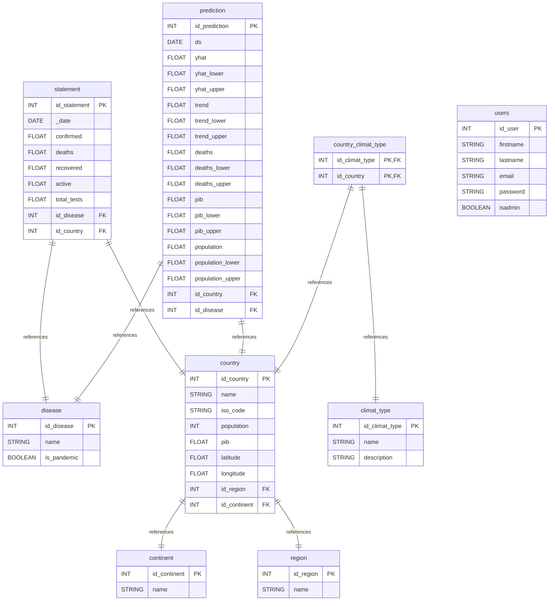

```mermaid
erDiagram
    disease {
        INT id_disease PK
        STRING name
        BOOLEAN is_pandemic
    }

    statement {
        INT id_statement PK
        DATE _date
        FLOAT confirmed
        FLOAT deaths
        FLOAT recovered
        FLOAT active
        FLOAT total_tests
        INT id_disease FK
        INT id_country FK
    }

    prediction {
        INT id_prediction PK
        DATE ds
        FLOAT yhat
        FLOAT yhat_lower
        FLOAT yhat_upper
        FLOAT trend
        FLOAT trend_lower
        FLOAT trend_upper
        FLOAT deaths
        FLOAT deaths_lower
        FLOAT deaths_upper
        FLOAT pib
        FLOAT pib_lower
        FLOAT pib_upper
        FLOAT population
        FLOAT population_lower
        FLOAT population_upper
        INT id_country FK
        INT id_disease FK
    }

    country {
        INT id_country PK
        STRING name
        STRING iso_code
        INT population
        FLOAT pib
        FLOAT latitude
        FLOAT longitude
        INT id_region FK
        INT id_continent FK
    }

    continent {
        INT id_continent PK
        STRING name
    }

    region {
        INT id_region PK
        STRING name
    }

    climat_type {
        INT id_climat_type PK
        STRING name
        STRING description
    }

    country_climat_type {
        INT id_climat_type PK, FK
        INT id_country PK, FK
    }

    users {
        INT id_user PK
        STRING firstname
        STRING lastname
        STRING email
        STRING password
        BOOLEAN isadmin
    }

    statement ||--|| disease : "references"
    statement ||--|| country : "references"

    prediction ||--|| disease : "references"
    prediction ||--|| country : "references"

    country ||--|| continent : "references"
    country ||--|| region : "references"

    country_climat_type ||--|| country : "references"
    country_climat_type ||--|| climat_type : "references"
```